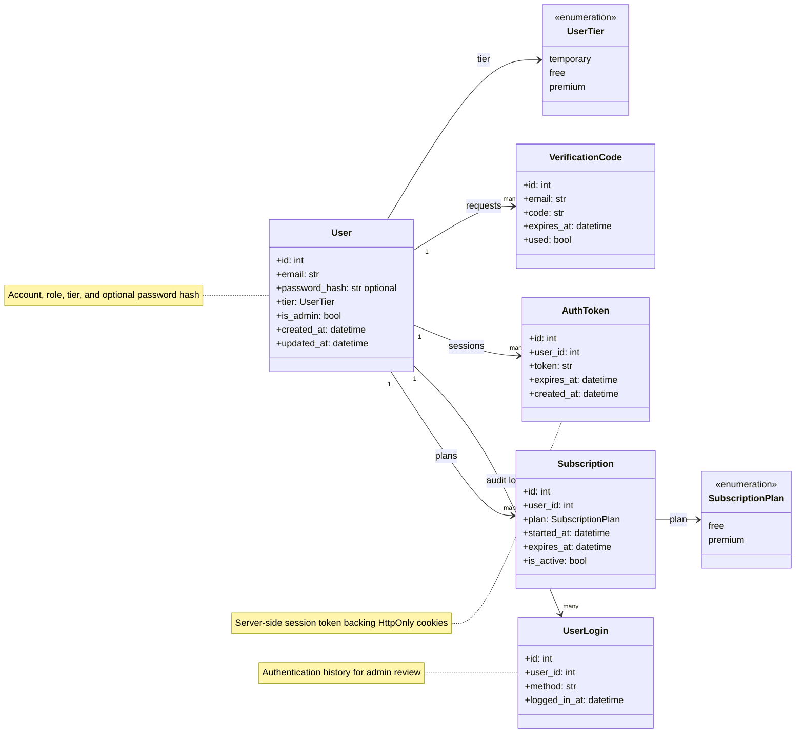
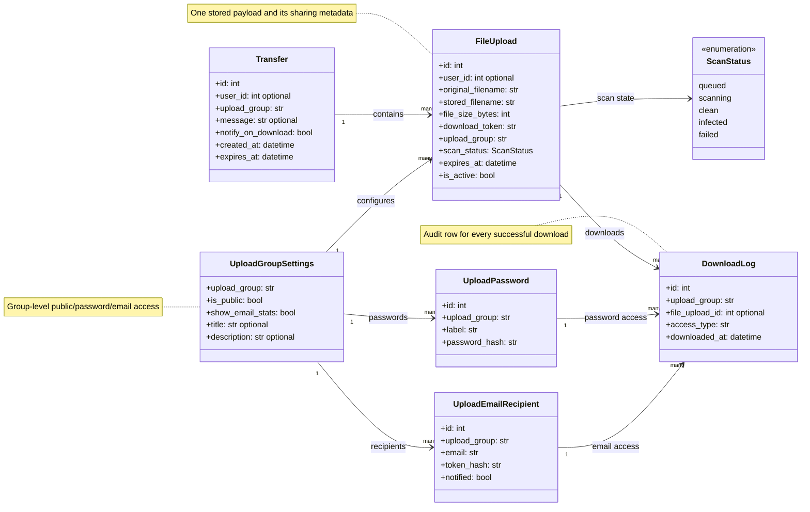

# Backend Database Models

The database model diagrams are split by responsibility to keep relationships readable.

## Users, Auth, And Subscriptions

## Transfers, Access, And Audit

---

SQLModel entities for users, transfers, access controls, malware scan state, subscriptions, and download auditing.
