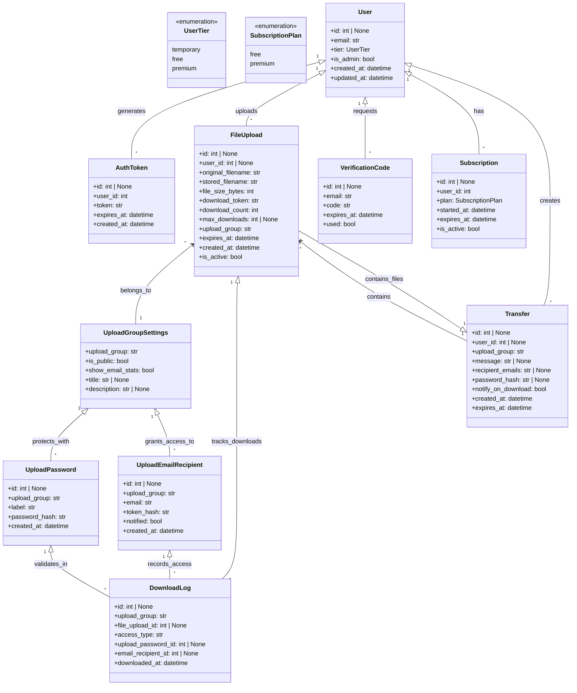

# Backend Database Models

```mermaid
classDiagram
    %% Enums
    class UserTier {
      <<enumeration>>
      temporary
      free
      premium
    }

    class SubscriptionPlan {
      <<enumeration>>
      free
      premium
    }

    %% Database Models (SQLModel)
    class User {
      +id: int | None
      +email: str
      +tier: UserTier
      +is_admin: bool
      +created_at: datetime
      +updated_at: datetime
    }

    class VerificationCode {
      +id: int | None
      +email: str
      +code: str
      +expires_at: datetime
      +used: bool
    }

    class AuthToken {
      +id: int | None
      +user_id: int
      +token: str
      +expires_at: datetime
      +created_at: datetime
    }

    class FileUpload {
      +id: int | None
      +user_id: int | None
      +original_filename: str
      +stored_filename: str
      +file_size_bytes: int
      +download_token: str
      +download_count: int
      +max_downloads: int | None
      +upload_group: str
      +expires_at: datetime
      +created_at: datetime
      +is_active: bool
    }

    class UploadGroupSettings {
      +upload_group: str
      +is_public: bool
      +show_email_stats: bool
      +title: str | None
      +description: str | None
    }

    class UploadPassword {
      +id: int | None
      +upload_group: str
      +label: str
      +password_hash: str
      +created_at: datetime
    }

    class UploadEmailRecipient {
      +id: int | None
      +upload_group: str
      +email: str
      +token_hash: str
      +notified: bool
      +created_at: datetime
    }

    class DownloadLog {
      +id: int | None
      +upload_group: str
      +file_upload_id: int | None
      +access_type: str
      +upload_password_id: int | None
      +email_recipient_id: int | None
      +downloaded_at: datetime
    }

    class Transfer {
      +id: int | None
      +user_id: int | None
      +upload_group: str
      +message: str | None
      +recipient_emails: str | None
      +password_hash: str | None
      +notify_on_download: bool
      +created_at: datetime
      +expires_at: datetime
    }

    class Subscription {
      +id: int | None
      +user_id: int
      +plan: SubscriptionPlan
      +started_at: datetime
      +expires_at: datetime
      +is_active: bool
    }

    %% Relationships
    User "1" <|-- "*" AuthToken : generates
    User "1" <|-- "*" FileUpload : uploads
    User "1" <|-- "*" VerificationCode : requests
    User "1" <|-- "*" Subscription : has
    User "1" <|-- "*" Transfer : creates

    FileUpload "*" <-- "1" UploadGroupSettings : belongs_to
    FileUpload "1" <|-- "*" DownloadLog : tracks_downloads
    FileUpload "*" <-- "1" Transfer : contains

    UploadGroupSettings "1" <|-- "*" UploadPassword : protects_with
    UploadGroupSettings "1" <|-- "*" UploadEmailRecipient : grants_access_to

    UploadPassword "1" <|-- "*" DownloadLog : validates_in
    UploadEmailRecipient "1" <|-- "*" DownloadLog : records_access

    Transfer "1" <|-- "*" FileUpload : contains_files
```

---

Modele bazy danych reprezentujące wszystkie encje systemu SendR.
