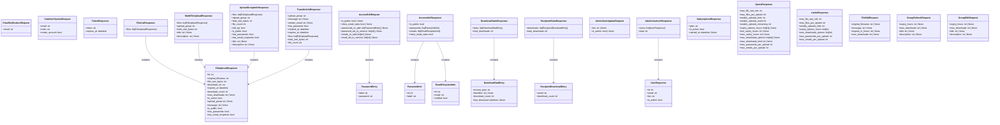

# Backend API Schemas (Pydantic)

```mermaid
classDiagram
    %% Authentication Schemas
    class EmailVerificationRequest {
      +email: str
    }

    class CodeVerificationRequest {
      +email: str
      +code: str
      +create_account: bool
    }

    class TokenResponse {
      +token: str
      +expires_at: datetime
    }

    class UserResponse {
      +id: int
      +email: str
      +tier: str
      +is_admin: bool
    }

    %% File Management Schemas
    class FileUploadResponse {
      +id: int
      +original_filename: str
      +file_size_bytes: int
      +download_url: str
      +expires_at: datetime
      +download_count: int
      +max_downloads: int | None
      +is_active: bool
      +upload_group: str | None
      +message: str | None
      +is_public: bool
      +has_passwords: bool
      +has_email_recipients: bool
    }

    class FileListResponse {
      +files: list[FileUploadResponse]
    }

    class MultiFileUploadResponse {
      +files: list[FileUploadResponse]
      +upload_group: str
      +total_size_bytes: int
      +title: str | None
      +description: str | None
    }

    class UploadGroupInfoResponse {
      +files: list[FileUploadResponse]
      +upload_group: str
      +total_size_bytes: int
      +file_count: int
      +will_zip: bool
      +is_public: bool
      +has_passwords: bool
      +has_email_recipients: bool
      +title: str | None
      +description: str | None
    }

    class TransferInfoResponse {
      +upload_group: str
      +message: str | None
      +sender_email: str | None
      +has_password: bool
      +created_at: datetime
      +expires_at: datetime
      +files: list[FileUploadResponse]
      +total_size_bytes: int
      +file_count: int
    }

    %% Access Control Schemas
    class PasswordInfo {
      +id: int
      +label: str
    }

    class EmailRecipientInfo {
      +id: int
      +email: str
      +notified: bool
    }

    class PasswordEntry {
      +label: str
      +password: str
    }

    class AccessEditRequest {
      +is_public: bool | None
      +show_email_stats: bool | None
      +passwords_to_add: list[PasswordEntry] | None
      +password_ids_to_remove: list[int] | None
      +emails_to_add: list[str] | None
      +email_ids_to_remove: list[int] | None
    }

    class AccessInfoResponse {
      +is_public: bool
      +passwords: list[PasswordInfo]
      +emails: list[EmailRecipientInfo]
      +show_email_stats: bool
    }

    class DownloadStatEntry {
      +access_type: str
      +identifier: str | None
      +download_count: int
      +last_download: datetime | None
    }

    class DownloadStatsResponse {
      +stats: list[DownloadStatEntry]
      +total_downloads: int
    }

    class RecipientDownloadEntry {
      +email: str
      +download_count: int
    }

    class RecipientStatsResponse {
      +downloads: list[RecipientDownloadEntry]
      +total_downloads: int
    }

    %% Admin Schemas
    class AdminUserUpdateRequest {
      +tier: str | None
      +is_admin: bool | None
    }

    class AdminUserListResponse {
      +users: list[UserResponse]
      +total: int
    }

    %% Subscription Schemas
    class SubscriptionResponse {
      +plan: str
      +is_active: bool
      +started_at: datetime | None
    }

    %% Utility Schemas
    class QuotaResponse {
      +max_file_size_mb: int
      +max_files_per_upload: int
      +weekly_uploads_limit: int
      +weekly_uploads_used: int
      +weekly_uploads_remaining: int
      +expiry_options_hours: list[int] | None
      +min_expiry_hours: int | None
      +max_expiry_hours: int | None
      +max_downloads_options: list[int] | None
      +max_downloads_limit: int | None
      +max_passwords_per_upload: int
      +max_emails_per_upload: int
    }

    class LimitsResponse {
      +max_file_size_mb: int
      +max_files_per_upload: int
      +weekly_uploads_limit: int
      +expiry_options_hours: list[int]
      +max_downloads_options: list[int]
      +max_passwords_per_upload: int
      +max_emails_per_upload: int
    }

    class FileEditRequest {
      +original_filename: str | None
      +message: str | None
      +expires_in_hours: int | None
      +max_downloads: int | None
    }

    class GroupRefreshRequest {
      +expiry_hours: int | None
      +max_downloads: int | None
      +title: str | None
      +description: str | None
    }

    class GroupEditRequest {
      +expiry_hours: int | None
      +max_downloads: int | None
      +title: str | None
      +description: str | None
    }

    %% Relationships
    FileListResponse --> FileUploadResponse : contains
    MultiFileUploadResponse --> FileUploadResponse : contains
    UploadGroupInfoResponse --> FileUploadResponse : contains
    TransferInfoResponse --> FileUploadResponse : contains

    AccessInfoResponse --> PasswordInfo : contains
    AccessInfoResponse --> EmailRecipientInfo : contains
    AccessEditRequest --> PasswordEntry : contains

    DownloadStatsResponse --> DownloadStatEntry : contains
    RecipientStatsResponse --> RecipientDownloadEntry : contains

    AdminUserListResponse --> UserResponse : contains
```

---

Schematy Pydantic używane do walidacji request/response w API.
