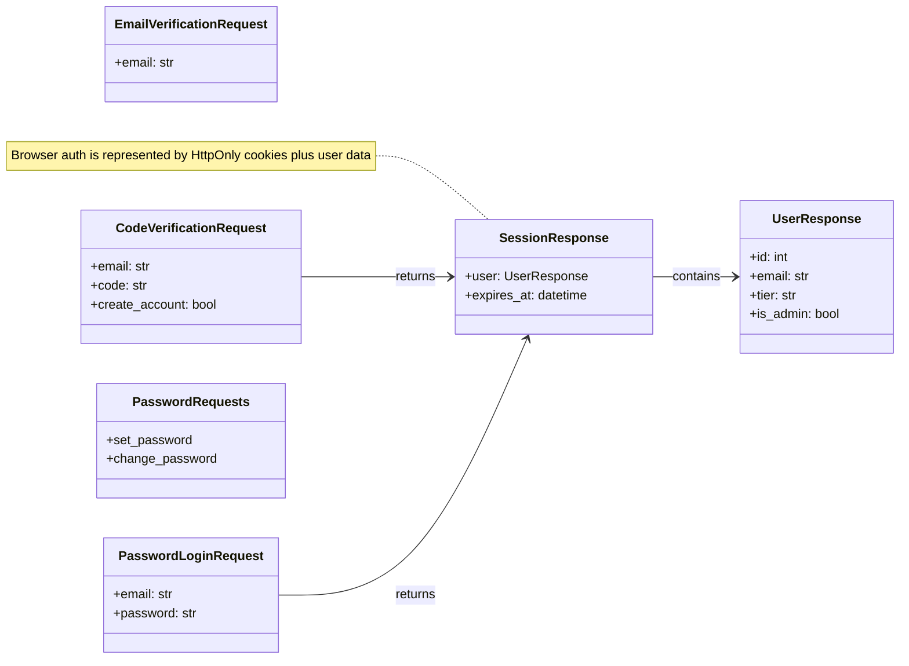
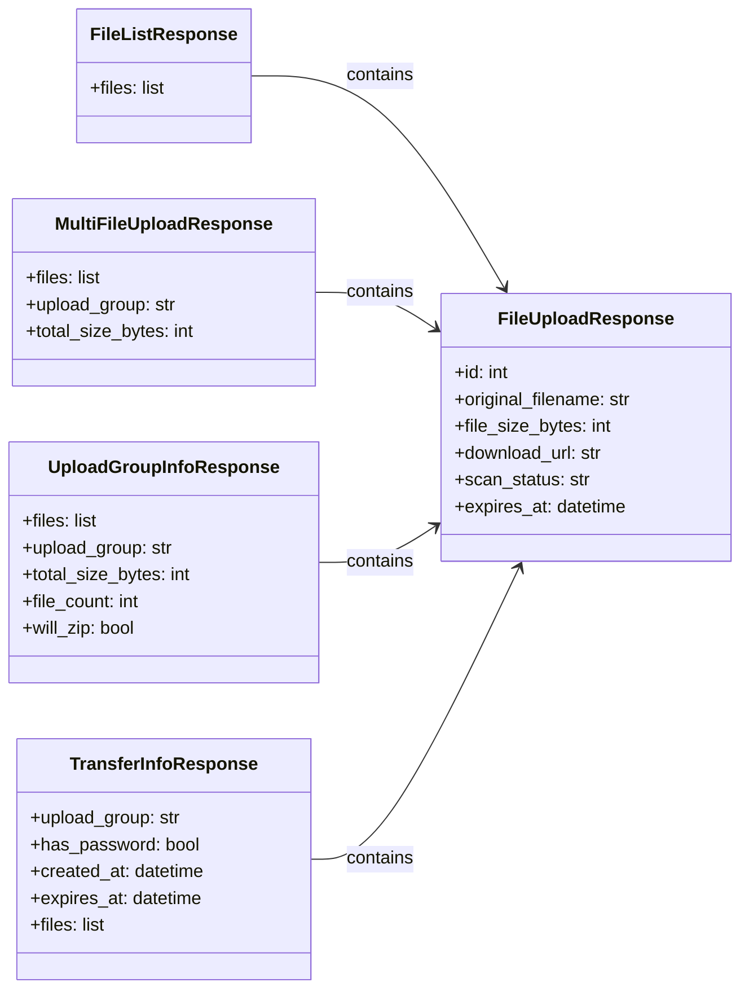
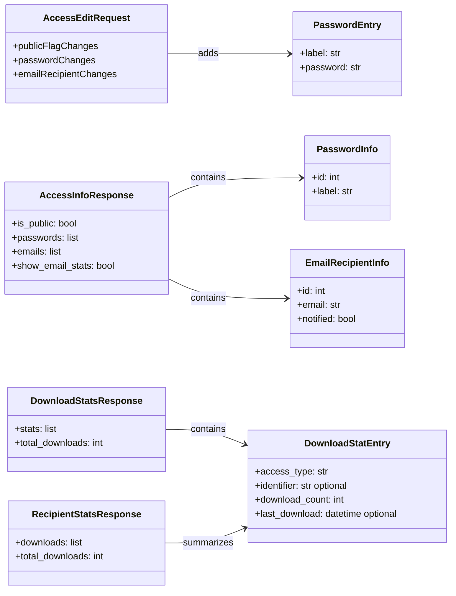
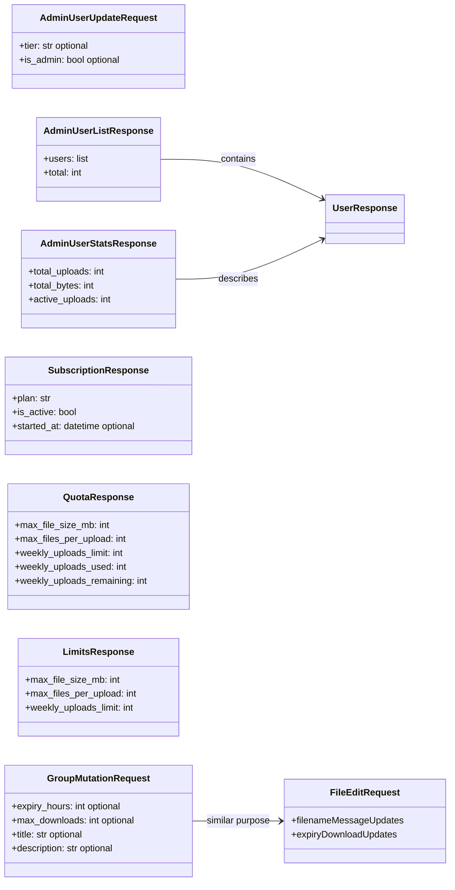

# Backend API Schemas (Pydantic)

The API schemas are grouped by request area instead of listed as one oversized diagram.

## Auth And Account Schemas

## File And Group Schemas

## Access And Statistics Schemas

## Admin, Limits, And Mutations

---

Pydantic request and response schemas used by the FastAPI contract.