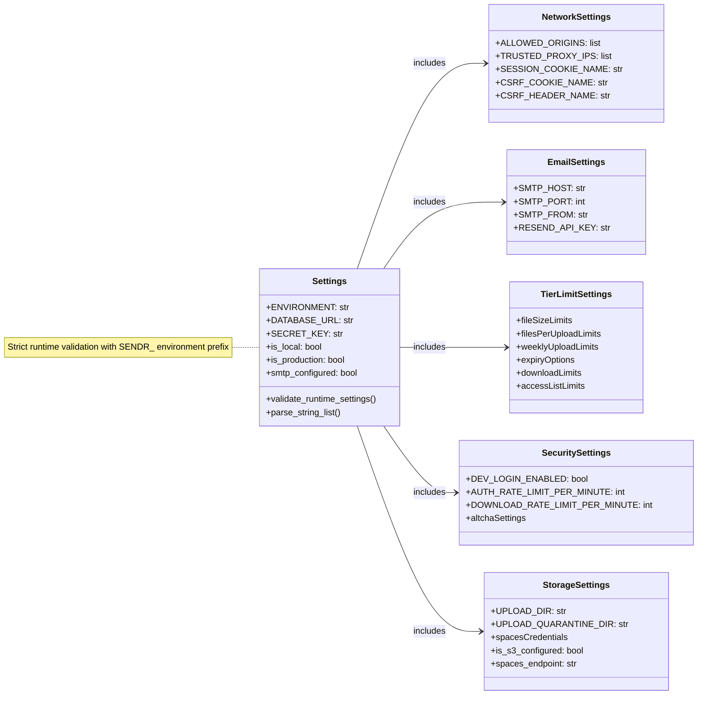
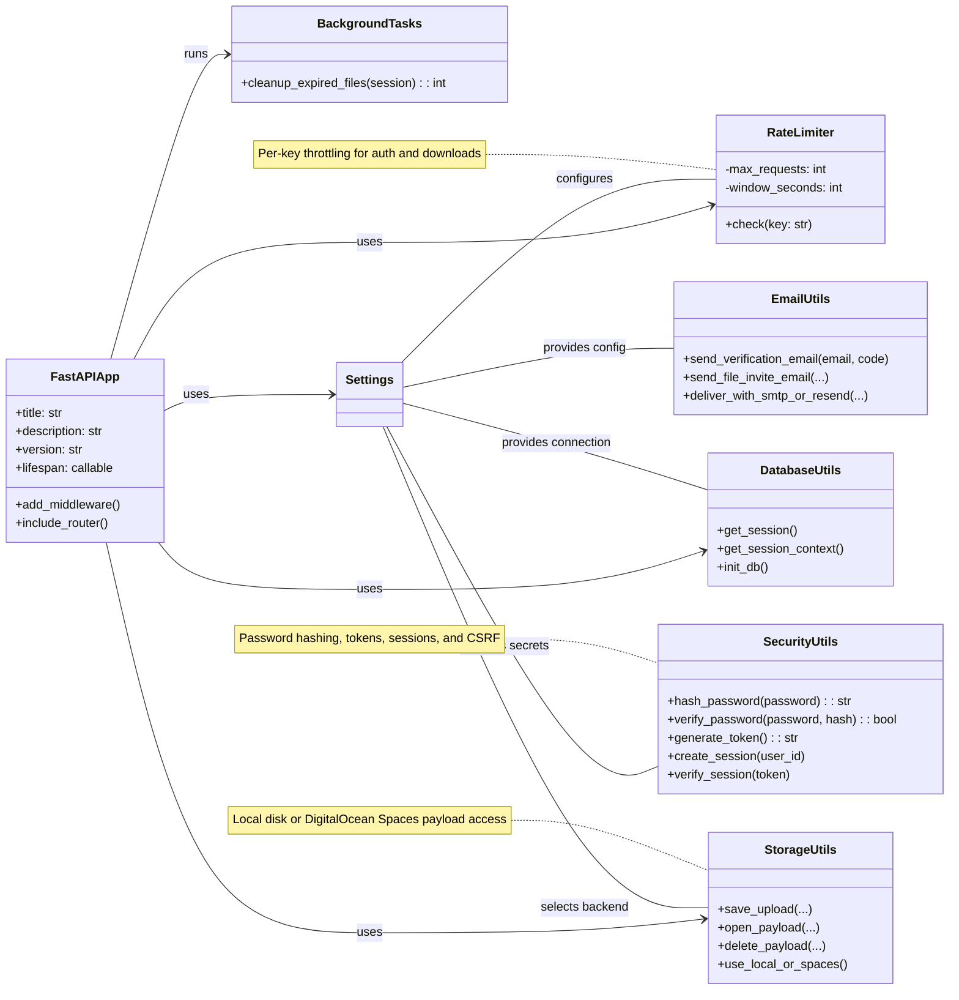

# Backend Utilities & Infrastructure

The backend infrastructure diagram is split into configuration groups and runtime services to avoid one oversized settings box.

## Runtime Configuration

## Backend Services

---

Backend configuration, infrastructure helpers, and application-level services.
