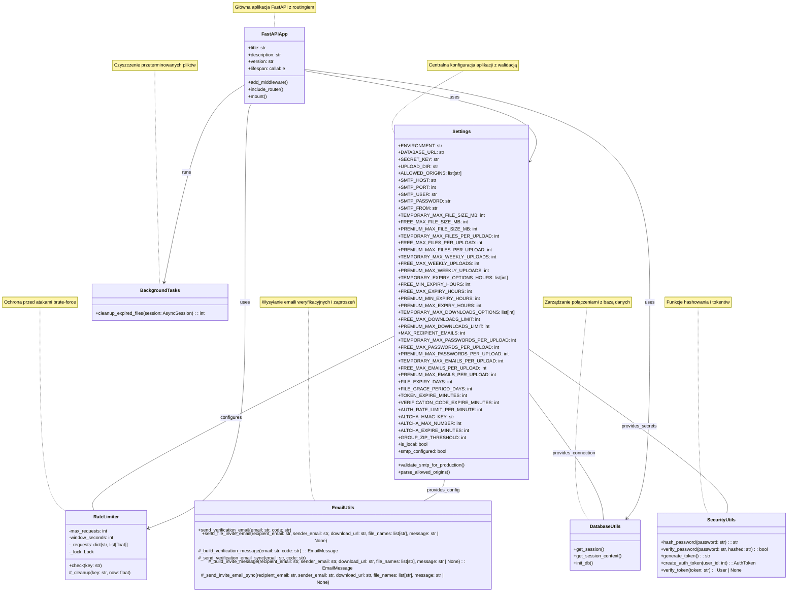

# Backend Utilities & Infrastructure

```mermaid
classDiagram
    %% Configuration
    class Settings {
      +ENVIRONMENT: str
      +DATABASE_URL: str
      +SECRET_KEY: str
      +UPLOAD_DIR: str
      +ALLOWED_ORIGINS: list[str]
      +SMTP_HOST: str
      +SMTP_PORT: int
      +SMTP_USER: str
      +SMTP_PASSWORD: str
      +SMTP_FROM: str
      +TEMPORARY_MAX_FILE_SIZE_MB: int
      +FREE_MAX_FILE_SIZE_MB: int
      +PREMIUM_MAX_FILE_SIZE_MB: int
      +TEMPORARY_MAX_FILES_PER_UPLOAD: int
      +FREE_MAX_FILES_PER_UPLOAD: int
      +PREMIUM_MAX_FILES_PER_UPLOAD: int
      +TEMPORARY_MAX_WEEKLY_UPLOADS: int
      +FREE_MAX_WEEKLY_UPLOADS: int
      +PREMIUM_MAX_WEEKLY_UPLOADS: int
      +TEMPORARY_EXPIRY_OPTIONS_HOURS: list[int]
      +FREE_MIN_EXPIRY_HOURS: int
      +FREE_MAX_EXPIRY_HOURS: int
      +PREMIUM_MIN_EXPIRY_HOURS: int
      +PREMIUM_MAX_EXPIRY_HOURS: int
      +TEMPORARY_MAX_DOWNLOADS_OPTIONS: list[int]
      +FREE_MAX_DOWNLOADS_LIMIT: int
      +PREMIUM_MAX_DOWNLOADS_LIMIT: int
      +MAX_RECIPIENT_EMAILS: int
      +TEMPORARY_MAX_PASSWORDS_PER_UPLOAD: int
      +FREE_MAX_PASSWORDS_PER_UPLOAD: int
      +PREMIUM_MAX_PASSWORDS_PER_UPLOAD: int
      +TEMPORARY_MAX_EMAILS_PER_UPLOAD: int
      +FREE_MAX_EMAILS_PER_UPLOAD: int
      +PREMIUM_MAX_EMAILS_PER_UPLOAD: int
      +FILE_EXPIRY_DAYS: int
      +FILE_GRACE_PERIOD_DAYS: int
      +TOKEN_EXPIRE_MINUTES: int
      +VERIFICATION_CODE_EXPIRE_MINUTES: int
      +AUTH_RATE_LIMIT_PER_MINUTE: int
      +ALTCHA_HMAC_KEY: str
      +ALTCHA_MAX_NUMBER: int
      +ALTCHA_EXPIRE_MINUTES: int
      +GROUP_ZIP_THRESHOLD: int
      +is_local: bool
      +smtp_configured: bool
      +validate_smtp_for_production()
      +parse_allowed_origins()
    }

    %% Rate Limiting
    class RateLimiter {
      -max_requests: int
      -window_seconds: int
      -_requests: dict[str, list[float]]
      -_lock: Lock
      +check(key: str)
      #_cleanup(key: str, now: float)
    }

    %% Security Utilities
    class SecurityUtils {
      +hash_password(password: str): str
      +verify_password(password: str, hashed: str): bool
      +generate_token(): str
      +create_auth_token(user_id: int): AuthToken
      +verify_token(token: str): User | None
    }

    %% Email Utilities
    class EmailUtils {
      +send_verification_email(email: str, code: str)
      +send_file_invite_email(recipient_email: str, sender_email: str, download_url: str, file_names: list[str], message: str | None)
      #_build_verification_message(email: str, code: str): EmailMessage
      #_send_verification_email_sync(email: str, code: str)
      #_build_invite_message(recipient_email: str, sender_email: str, download_url: str, file_names: list[str], message: str | None): EmailMessage
      #_send_invite_email_sync(recipient_email: str, sender_email: str, download_url: str, file_names: list[str], message: str | None)
    }

    %% Database Utilities
    class DatabaseUtils {
      +get_session()
      +get_session_context()
      +init_db()
    }

    %% Background Tasks
    class BackgroundTasks {
      +cleanup_expired_files(session: AsyncSession): int
    }

    %% FastAPI Application
    class FastAPIApp {
      +title: str
      +description: str
      +version: str
      +lifespan: callable
      +add_middleware()
      +include_router()
      +mount()
    }

    %% Relationships
    Settings -- RateLimiter : configures
    Settings -- EmailUtils : provides_config
    Settings -- DatabaseUtils : provides_connection
    Settings -- SecurityUtils : provides_secrets

    FastAPIApp --> Settings : uses
    FastAPIApp --> RateLimiter : uses
    FastAPIApp --> DatabaseUtils : uses
    FastAPIApp --> BackgroundTasks : runs

    note for Settings "Centralna konfiguracja aplikacji z walidacją"
    note for RateLimiter "Ochrona przed atakami brute-force"
    note for SecurityUtils "Funkcje hashowania i tokenów"
    note for EmailUtils "Wysyłanie emaili weryfikacyjnych i zaproszeń"
    note for DatabaseUtils "Zarządzanie połączeniami z bazą danych"
    note for BackgroundTasks "Czyszczenie przeterminowanych plików"
    note for FastAPIApp "Główna aplikacja FastAPI z routingiem"
```

---

Narzędzia infrastrukturalne, konfiguracja i usługi pomocnicze backendu.
