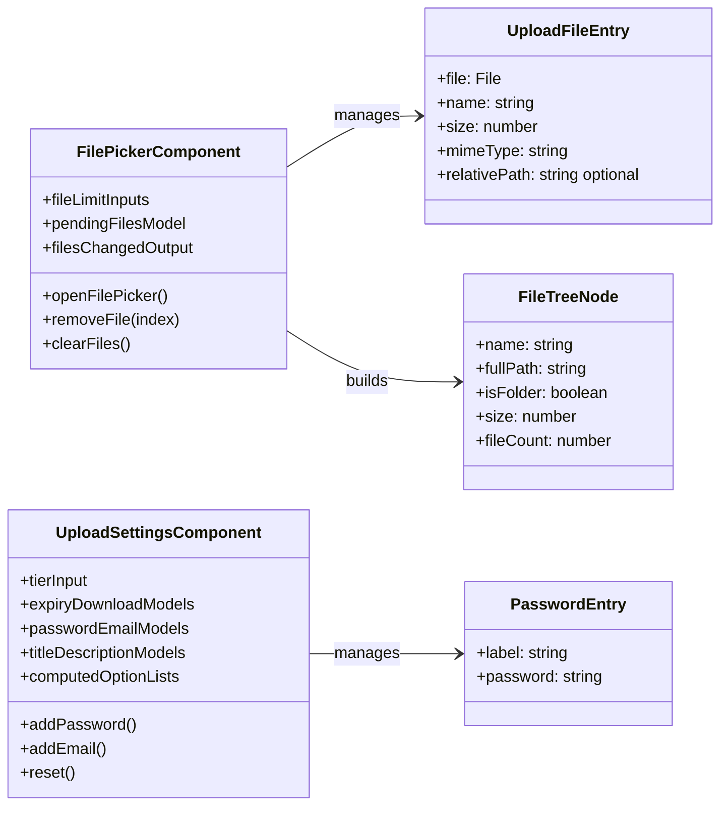
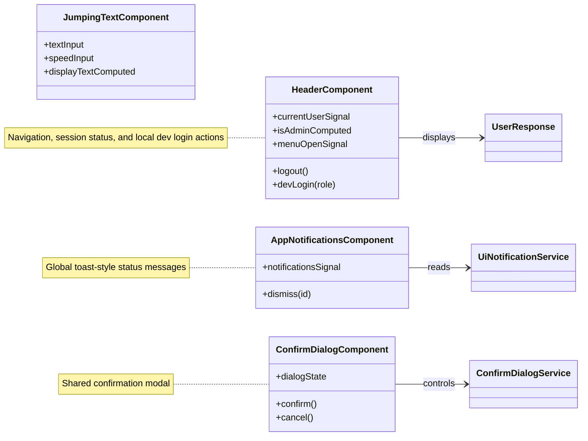

# Frontend Angular Components

Components are grouped by UI responsibility and use compact signal notation.

## Upload Components

## Shell And Feedback Components

---

Angular components and the data structures they manage.