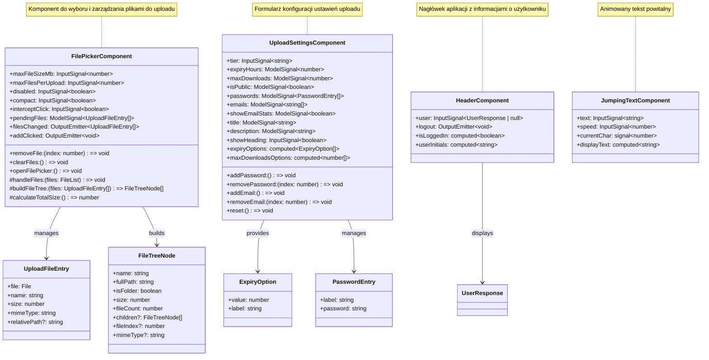

# Frontend Angular Components

```mermaid
classDiagram
    %% Component Interfaces
    class UploadFileEntry {
      +file: File
      +name: string
      +size: number
      +mimeType: string
      +relativePath?: string
    }

    class FileTreeNode {
      +name: string
      +fullPath: string
      +isFolder: boolean
      +size: number
      +fileCount: number
      +children?: FileTreeNode[]
      +fileIndex?: number
      +mimeType?: string
    }

    class ExpiryOption {
      +value: number
      +label: string
    }

    class PasswordEntry {
      +label: string
      +password: string
    }

    %% File Picker Component
    class FilePickerComponent {
      +maxFileSizeMb: InputSignal~number~
      +maxFilesPerUpload: InputSignal~number~
      +disabled: InputSignal~boolean~
      +compact: InputSignal~boolean~
      +interceptClick: InputSignal~boolean~
      +pendingFiles: ModelSignal~UploadFileEntry[]~
      +filesChanged: OutputEmitter~UploadFileEntry[]~
      +addClicked: OutputEmitter~void~
      +removeFile: (index: number) => void
      +clearFiles: () => void
      +openFilePicker: () => void
      #handleFiles: (files: FileList) => void
      #buildFileTree: (files: UploadFileEntry[]) => FileTreeNode[]
      #calculateTotalSize: () => number
    }

    %% Upload Settings Component
    class UploadSettingsComponent {
      +tier: InputSignal~string~
      +expiryHours: ModelSignal~number~
      +maxDownloads: ModelSignal~number~
      +isPublic: ModelSignal~boolean~
      +passwords: ModelSignal~PasswordEntry[]~
      +emails: ModelSignal~string[]~
      +showEmailStats: ModelSignal~boolean~
      +title: ModelSignal~string~
      +description: ModelSignal~string~
      +showHeading: InputSignal~boolean~
      +expiryOptions: computed~ExpiryOption[]~
      +maxDownloadsOptions: computed~number[]~
      +addPassword: () => void
      +removePassword: (index: number) => void
      +addEmail: () => void
      +removeEmail: (index: number) => void
      +reset: () => void
    }

    %% Header Component
    class HeaderComponent {
      +user: InputSignal~UserResponse | null~
      +logout: OutputEmitter~void~
      +isLoggedIn: computed~boolean~
      +userInitials: computed~string~
    }

    %% Jumping Text Component
    class JumpingTextComponent {
      +text: InputSignal~string~
      +speed: InputSignal~number~
      +currentChar: signal~number~
      +displayText: computed~string~
    }

    %% Relationships
    FilePickerComponent --> UploadFileEntry : manages
    FilePickerComponent --> FileTreeNode : builds

    UploadSettingsComponent --> ExpiryOption : provides
    UploadSettingsComponent --> PasswordEntry : manages

    HeaderComponent --> UserResponse : displays

    note for FilePickerComponent "Komponent do wyboru i zarządzania plikami do uploadu"
    note for UploadSettingsComponent "Formularz konfiguracji ustawień uploadu"
    note for HeaderComponent "Nagłówek aplikacji z informacjami o użytkowniku"
    note for JumpingTextComponent "Animowany tekst powitalny"
```

---

Komponenty Angular z ich interfejsami i właściwościami.
