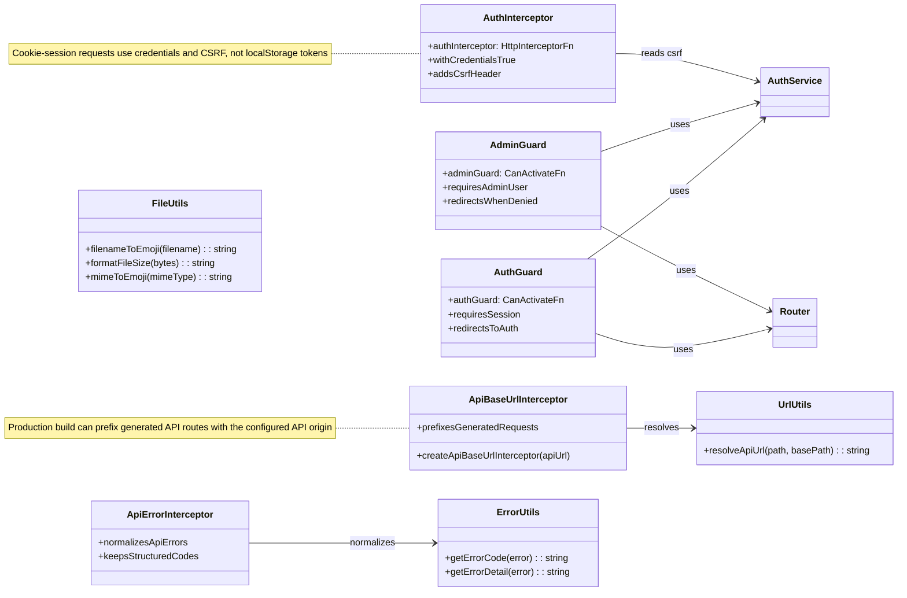

web# Frontend Guards, Interceptors & Utilities

```mermaid
classDiagram
    direction LR

    class AuthGuard {
      +authGuard: CanActivateFn
      +requiresSession
      +redirectsToAuth
    }

    class AdminGuard {
      +adminGuard: CanActivateFn
      +requiresAdminUser
      +redirectsWhenDenied
    }

    class AuthInterceptor {
      +authInterceptor: HttpInterceptorFn
      +withCredentialsTrue
      +addsCsrfHeader
    }

    class ApiBaseUrlInterceptor {
      +createApiBaseUrlInterceptor(apiUrl)
      +prefixesGeneratedRequests
    }

    class ApiErrorInterceptor {
      +normalizesApiErrors
      +keepsStructuredCodes
    }

    class FileUtils {
      +filenameToEmoji(filename): string
      +formatFileSize(bytes): string
      +mimeToEmoji(mimeType): string
    }

    class UrlUtils {
      +resolveApiUrl(path, basePath): string
    }

    class ErrorUtils {
      +getErrorCode(error): string
      +getErrorDetail(error): string
    }

    AuthGuard --> AuthService : uses
    AuthGuard --> Router : uses
    AdminGuard --> AuthService : uses
    AdminGuard --> Router : uses
    AuthInterceptor --> AuthService : reads csrf
    ApiBaseUrlInterceptor --> UrlUtils : resolves
    ApiErrorInterceptor --> ErrorUtils : normalizes

    note for AuthInterceptor "Cookie-session requests use credentials and CSRF, not localStorage tokens"
    note for ApiBaseUrlInterceptor "Production build can prefix generated API routes with the configured API origin"
```

---

Route guards, HTTP interceptors, and small frontend utility modules.
