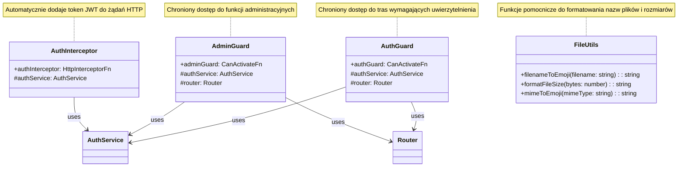

# Frontend Guards, Interceptors & Utilities

```mermaid
classDiagram
    %% Guards
    class AuthGuard {
      +authGuard: CanActivateFn
      #authService: AuthService
      #router: Router
    }

    class AdminGuard {
      +adminGuard: CanActivateFn
      #authService: AuthService
      #router: Router
    }

    %% Interceptors
    class AuthInterceptor {
      +authInterceptor: HttpInterceptorFn
      #authService: AuthService
    }

    %% Utility Functions
    class FileUtils {
      +filenameToEmoji(filename: string): string
      +formatFileSize(bytes: number): string
      +mimeToEmoji(mimeType: string): string
    }

    %% Relationships
    AuthGuard --> AuthService : uses
    AuthGuard --> Router : uses

    AdminGuard --> AuthService : uses
    AdminGuard --> Router : uses

    AuthInterceptor --> AuthService : uses

    note for AuthGuard "Chroniony dostęp do tras wymagających uwierzytelnienia"
    note for AdminGuard "Chroniony dostęp do funkcji administracyjnych"
    note for AuthInterceptor "Automatycznie dodaje token JWT do żądań HTTP"
    note for FileUtils "Funkcje pomocnicze do formatowania nazw plików i rozmiarów"
```

---

Ochrona tras, interceptory HTTP i funkcje narzędziowe frontendu.
