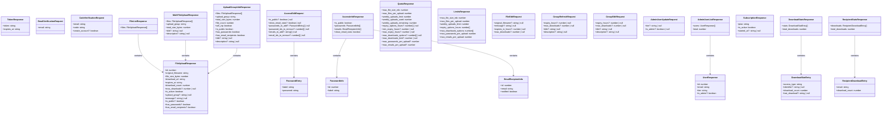

# Frontend TypeScript Models

```mermaid
classDiagram
    %% Authentication Models
    class UserResponse {
      +id: number
      +email: string
      +tier: string
      +is_admin?: boolean
    }

    class TokenResponse {
      +token: string
      +expires_at: string
    }

    class EmailVerificationRequest {
      +email: string
    }

    class CodeVerificationRequest {
      +email: string
      +code: string
      +create_account?: boolean
    }

    %% File Management Models
    class FileUploadResponse {
      +id: number
      +original_filename: string
      +file_size_bytes: number
      +download_url: string
      +expires_at: string
      +download_count: number
      +max_downloads?: number | null
      +is_active: boolean
      +upload_group?: string | null
      +message?: string | null
      +is_public?: boolean
      +has_passwords?: boolean
      +has_email_recipients?: boolean
    }

    class FileListResponse {
      +files: FileUploadResponse[]
    }

    class MultiFileUploadResponse {
      +files: FileUploadResponse[]
      +upload_group: string
      +total_size_bytes: number
      +title?: string | null
      +description?: string | null
    }

    class UploadGroupInfoResponse {
      +files: FileUploadResponse[]
      +upload_group: string
      +total_size_bytes: number
      +file_count: number
      +will_zip: boolean
      +is_public: boolean
      +has_passwords: boolean
      +has_email_recipients: boolean
      +title?: string | null
      +description?: string | null
    }

    %% Access Control Models
    class PasswordInfo {
      +id: number
      +label: string
    }

    class EmailRecipientInfo {
      +id: number
      +email: string
      +notified: boolean
    }

    class PasswordEntry {
      +label: string
      +password: string
    }

    class AccessEditRequest {
      +is_public?: boolean | null
      +show_email_stats?: boolean | null
      +passwords_to_add?: PasswordEntry[] | null
      +password_ids_to_remove?: number[] | null
      +emails_to_add?: string[] | null
      +email_ids_to_remove?: number[] | null
    }

    class AccessInfoResponse {
      +is_public: boolean
      +passwords: PasswordInfo[]
      +emails: EmailRecipientInfo[]
      +show_email_stats: boolean
    }

    %% Quota & Limits Models
    class QuotaResponse {
      +max_file_size_mb: number
      +max_files_per_upload: number
      +weekly_uploads_limit: number
      +weekly_uploads_used: number
      +weekly_uploads_remaining: number
      +expiry_options_hours?: number[] | null
      +min_expiry_hours?: number | null
      +max_expiry_hours?: number | null
      +max_downloads_options?: number[] | null
      +max_downloads_limit?: number | null
      +max_passwords_per_upload?: number
      +max_emails_per_upload?: number
    }

    class LimitsResponse {
      +max_file_size_mb: number
      +max_files_per_upload: number
      +weekly_uploads_limit: number
      +expiry_options_hours: number[]
      +max_downloads_options: number[]
      +max_passwords_per_upload: number
      +max_emails_per_upload: number
    }

    %% Edit Request Models
    class FileEditRequest {
      +original_filename?: string | null
      +message?: string | null
      +expires_in_hours?: number | null
      +max_downloads?: number | null
    }

    class GroupRefreshRequest {
      +expiry_hours?: number | null
      +max_downloads?: number | null
      +title?: string | null
      +description?: string | null
    }

    class GroupEditRequest {
      +expiry_hours?: number | null
      +max_downloads?: number | null
      +title?: string | null
      +description?: string | null
    }

    %% Admin Models
    class AdminUserUpdateRequest {
      +tier?: string | null
      +is_admin?: boolean | null
    }

    class AdminUserListResponse {
      +users: UserResponse[]
      +total: number
    }

    %% Subscription Models
    class SubscriptionResponse {
      +plan: string
      +is_active: boolean
      +started_at?: string | null
    }

    %% Statistics Models
    class DownloadStatEntry {
      +access_type: string
      +identifier?: string | null
      +download_count: number
      +last_download?: string | null
    }

    class DownloadStatsResponse {
      +stats: DownloadStatEntry[]
      +total_downloads: number
    }

    class RecipientDownloadEntry {
      +email: string
      +download_count: number
    }

    class RecipientStatsResponse {
      +downloads: RecipientDownloadEntry[]
      +total_downloads: number
    }

    %% Relationships
    FileListResponse --> FileUploadResponse : contains
    MultiFileUploadResponse --> FileUploadResponse : contains
    UploadGroupInfoResponse --> FileUploadResponse : contains

    AccessInfoResponse --> PasswordInfo : contains
    AccessInfoResponse --> EmailRecipientInfo : contains
    AccessEditRequest --> PasswordEntry : contains

    DownloadStatsResponse --> DownloadStatEntry : contains
    RecipientStatsResponse --> RecipientDownloadEntry : contains

    AdminUserListResponse --> UserResponse : contains
```

---

Modele TypeScript generowane automatycznie z OpenAPI spec backendu.
