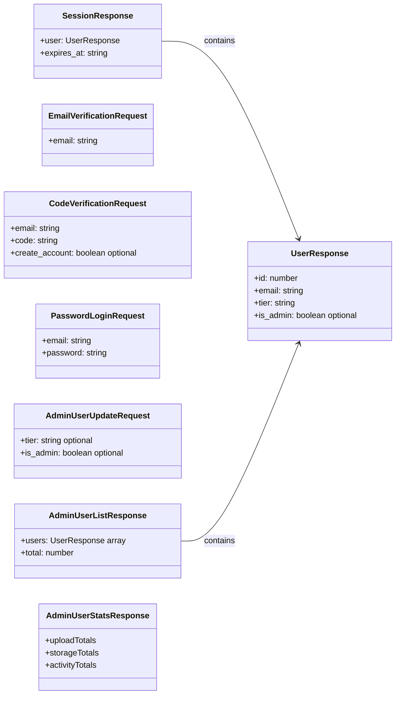
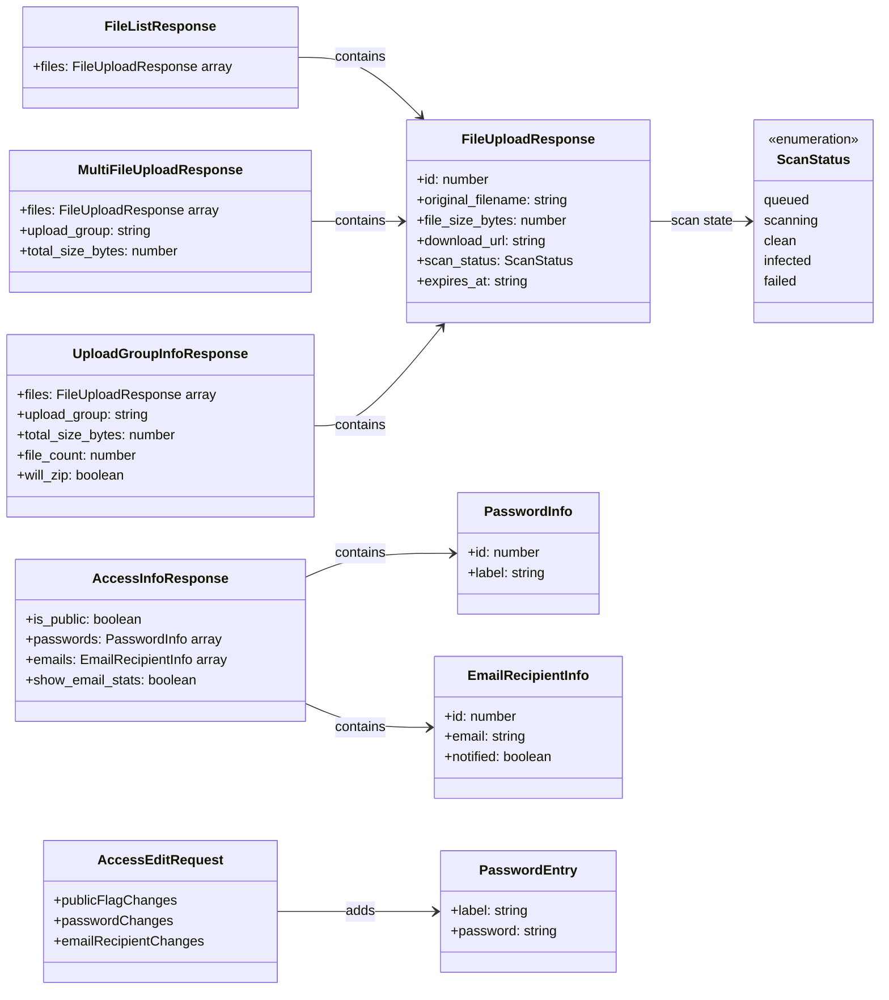
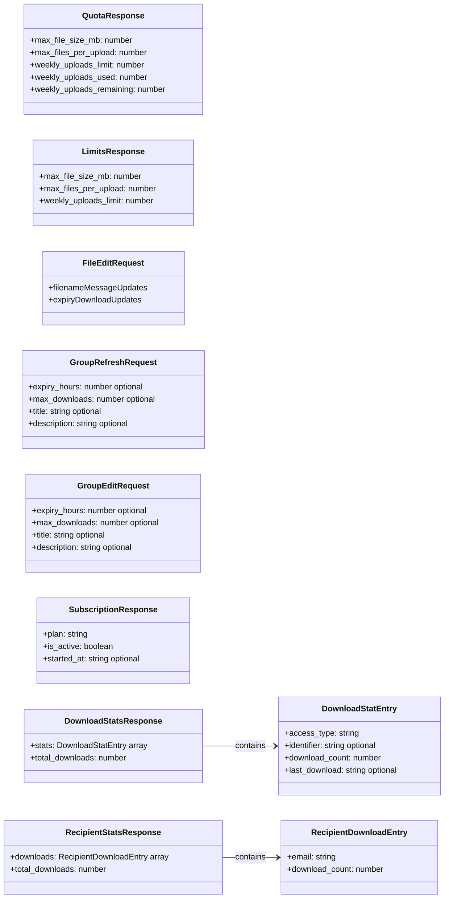

# Frontend TypeScript Models

Generated models are grouped by feature so the diagrams remain narrow.

## Auth And Admin Models

## File And Access Models

## Limits, Mutations, And Stats

---

TypeScript models generated from the backend OpenAPI contract.