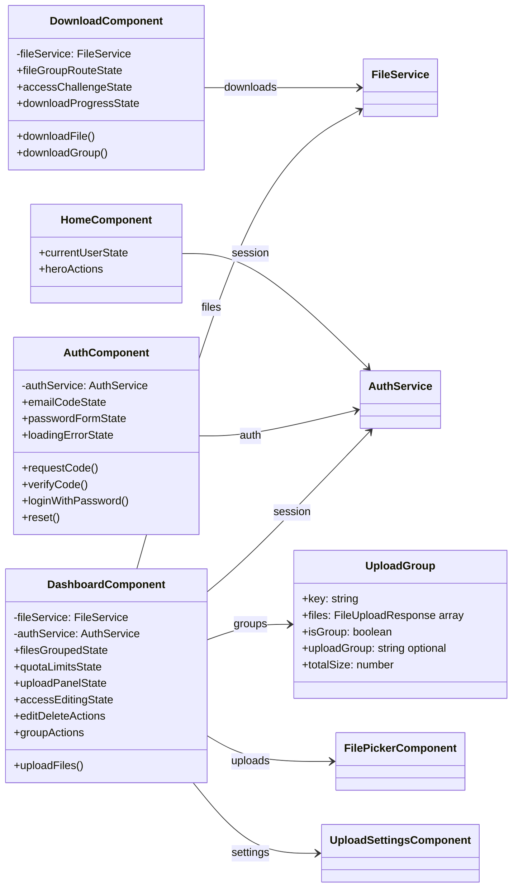
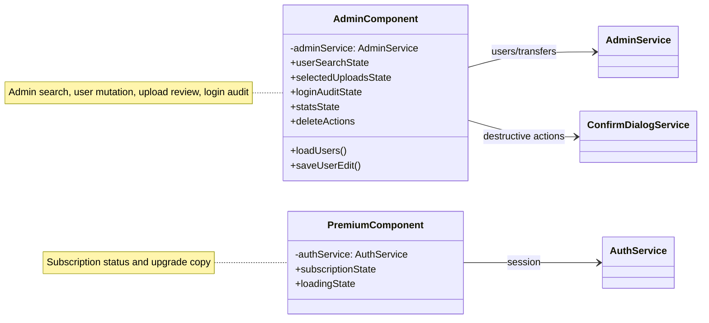

# Frontend Pages & Routes

Page diagrams focus on responsibilities and service dependencies rather than every signal and method on each component.

## Main User Pages

## Admin And Subscription Pages

---

Angular routed pages and their main service dependencies.