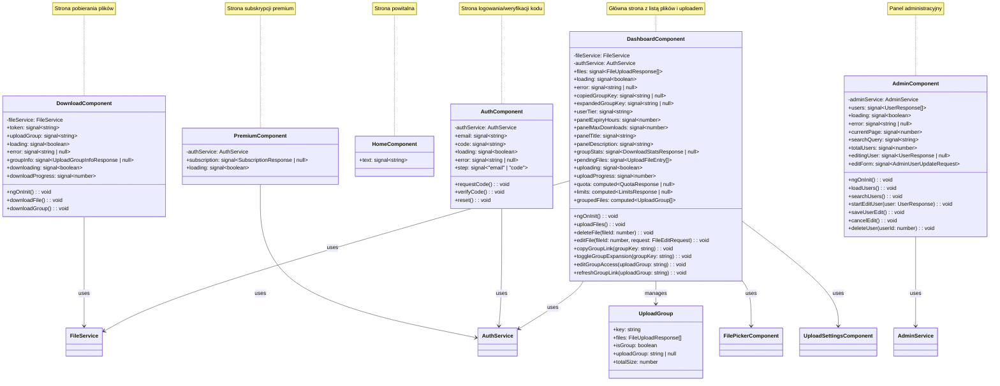

# Frontend Pages & Routes

```mermaid
classDiagram
    %% Page Interfaces
    class UploadGroup {
      +key: string
      +files: FileUploadResponse[]
      +isGroup: boolean
      +uploadGroup: string | null
      +totalSize: number
    }

    %% Dashboard Page
    class DashboardComponent {
      -fileService: FileService
      -authService: AuthService
      +files: signal~FileUploadResponse[]~
      +loading: signal~boolean~
      +error: signal~string | null~
      +copiedGroupKey: signal~string | null~
      +expandedGroupKey: signal~string | null~
      +userTier: signal~string~
      +panelExpiryHours: signal~number~
      +panelMaxDownloads: signal~number~
      +panelTitle: signal~string~
      +panelDescription: signal~string~
      +groupStats: signal~DownloadStatsResponse | null~
      +pendingFiles: signal~UploadFileEntry[]~
      +uploading: signal~boolean~
      +uploadProgress: signal~number~
      +quota: computed~QuotaResponse | null~
      +limits: computed~LimitsResponse | null~
      +groupedFiles: computed~UploadGroup[]~
      +ngOnInit(): void
      +uploadFiles(): void
      +deleteFile(fileId: number): void
      +editFile(fileId: number, request: FileEditRequest): void
      +copyGroupLink(groupKey: string): void
      +toggleGroupExpansion(groupKey: string): void
      +editGroupAccess(uploadGroup: string): void
      +refreshGroupLink(uploadGroup: string): void
    }

    %% Authentication Page
    class AuthComponent {
      -authService: AuthService
      +email: signal~string~
      +code: signal~string~
      +loading: signal~boolean~
      +error: signal~string | null~
      +step: signal~"email" | "code"~
      +requestCode(): void
      +verifyCode(): void
      +reset(): void
    }

    %% Home Page
    class HomeComponent {
      +text: signal~string~
    }

    %% Download Page
    class DownloadComponent {
      -fileService: FileService
      +token: signal~string~
      +uploadGroup: signal~string~
      +loading: signal~boolean~
      +error: signal~string | null~
      +groupInfo: signal~UploadGroupInfoResponse | null~
      +downloading: signal~boolean~
      +downloadProgress: signal~number~
      +ngOnInit(): void
      +downloadFile(): void
      +downloadGroup(): void
    }

    %% Admin Page
    class AdminComponent {
      -adminService: AdminService
      +users: signal~UserResponse[]~
      +loading: signal~boolean~
      +error: signal~string | null~
      +currentPage: signal~number~
      +searchQuery: signal~string~
      +totalUsers: signal~number~
      +editingUser: signal~UserResponse | null~
      +editForm: signal~AdminUserUpdateRequest~
      +ngOnInit(): void
      +loadUsers(): void
      +searchUsers(): void
      +startEditUser(user: UserResponse): void
      +saveUserEdit(): void
      +cancelEdit(): void
      +deleteUser(userId: number): void
    }

    %% Premium Page
    class PremiumComponent {
      -authService: AuthService
      +subscription: signal~SubscriptionResponse | null~
      +loading: signal~boolean~
    }

    %% Relationships
    DashboardComponent --> FileService : uses
    DashboardComponent --> AuthService : uses
    DashboardComponent --> UploadGroup : manages
    DashboardComponent --> FilePickerComponent : uses
    DashboardComponent --> UploadSettingsComponent : uses

    AuthComponent --> AuthService : uses

    DownloadComponent --> FileService : uses

    AdminComponent --> AdminService : uses

    PremiumComponent --> AuthService : uses

    note for DashboardComponent "Główna strona z listą plików i uploadem"
    note for AuthComponent "Strona logowania/weryfikacji kodu"
    note for HomeComponent "Strona powitalna"
    note for DownloadComponent "Strona pobierania plików"
    note for AdminComponent "Panel administracyjny"
    note for PremiumComponent "Strona subskrypcji premium"
```

---

Komponenty stron Angular z ich stanem i logiką biznesową.
