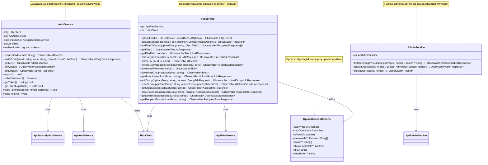

# Frontend Angular Services

```mermaid
classDiagram
    %% Authentication Service
    class AuthService {
      -http: HttpClient
      -api: ApiAuthService
      -subscriptionApi: ApiSubscriptionService
      -apiUrl: string
      +authenticated: signal~boolean~
      +requestCode(email: string): Observable~Record<string, string>~
      +verifyCode(email: string, code: string, createAccount?: boolean): Observable~VerifyCodeResponse~
      +getMe(): Observable~MeResponse~
      +getQuota(): Observable~QuotaResponse~
      +getLimits(): Observable~LimitsResponse~
      +logout(): void
      +isAuthenticated(): boolean
      +getToken(): string | null
      +getTokenExpiration(): Date | null
      #storeToken(response: TokenResponse): void
      #clearToken(): void
    }

    %% File Service
    class FileService {
      -api: ApiFilesService
      -http: HttpClient
      +uploadFile(file: File, options?: UploadAccessOptions): Observable~HttpEvent<FileUploadResponse>~
      +uploadMultipleFiles(files: File[], options?: UploadAccessOptions): Observable~HttpEvent<MultiFileUploadResponse>~
      +addFilesToGroup(uploadGroup: string, files: File[]): Observable~FileUploadResponse[]~
      +getFiles(): Observable~FileListResponse~
      +getFile(fileId: number): Observable~FileUploadResponse~
      +editFile(fileId: number, request: FileEditRequest): Observable~FileUploadResponse~
      +deleteFile(fileId: number): Observable~Record<string, string>~
      +refreshDownloadLink(fileId: number, params?: any): Observable~FileUploadResponse~
      +downloadFile(token: string): Observable~Blob~
      +downloadGroup(uploadGroup: string): Observable~Blob~
      +getGroupInfo(uploadGroup: string): Observable~UploadGroupInfoResponse~
      +editGroup(uploadGroup: string, request: GroupEditRequest): Observable~UploadGroupInfoResponse~
      +refreshGroup(uploadGroup: string, request: GroupRefreshRequest): Observable~UploadGroupInfoResponse~
      +getGroupAccess(uploadGroup: string): Observable~AccessInfoResponse~
      +editGroupAccess(uploadGroup: string, request: AccessEditRequest): Observable~AccessInfoResponse~
      +getDownloadStats(uploadGroup: string): Observable~DownloadStatsResponse~
      +getRecipientStats(uploadGroup: string): Observable~RecipientStatsResponse~
    }

    %% Admin Service
    class AdminService {
      -api: ApiAdminService
      +listUsers(page?: number, perPage?: number, search?: string): Observable~AdminUserListResponse~
      +updateUser(userId: number, update: AdminUserUpdateRequest): Observable~UserResponse~
      +deleteUser(userId: number): Observable~Record<string, string>~
    }

    %% Service Types
    class UploadAccessOptions {
      +expiryHours?: number
      +maxDownloads?: number
      +isPublic?: boolean
      +passwords?: PasswordEntry[]
      +emails?: string[]
      +showEmailStats?: boolean
      +title?: string
      +description?: string
    }
    
    

    %% Relationships
    AuthService --> HttpClient : uses
    AuthService --> ApiAuthService : uses
    AuthService --> ApiSubscriptionService : uses

    FileService --> ApiFilesService : uses
    FileService --> HttpClient : uses

    AdminService --> ApiAdminService : uses

    FileService --> UploadAccessOptions : uses

    note for AuthService "Zarządza uwierzytelnianiem, tokenami i sesjami użytkownika"
    note for FileService "Obsługuje wszystkie operacje na plikach i grupach"
    note for AdminService "Funkcje administracyjne dla zarządzania użytkownikami"
    note for UploadAccessOptions "Opcje konfiguracji dostępu przy uploadzie plików"
```

---

Serwisy Angular komunikujące się z backend API.
