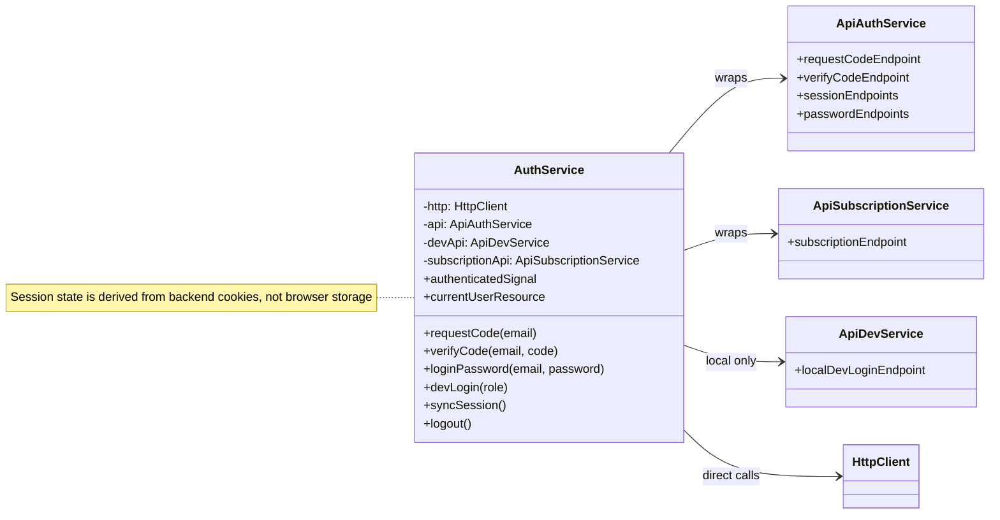
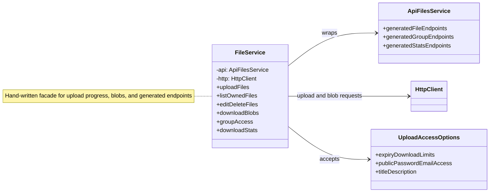
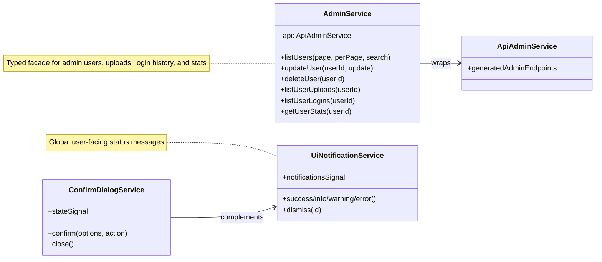

# Frontend Angular Services

Services are shown by responsibility. Generated OpenAPI endpoint services are represented as API adapters to avoid long generated method names.

## Session And Auth Services

## File Services

## Admin And UI Services

---

Angular services and generated API adapters used by the frontend.