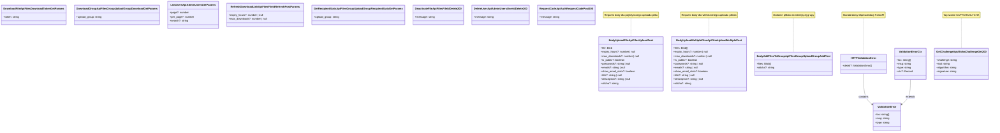

# Reference Schemas & Request Bodies

```mermaid
classDiagram
    %% Upload Request Bodies
    class BodyUploadFileApiFilesUploadPost {
      +file: Blob
      +expiry_hours?: number | null
      +max_downloads?: number | null
      +is_public?: boolean
      +passwords?: string | null
      +emails?: string | null
      +show_email_stats?: boolean
      +title?: string | null
      +description?: string | null
      +altcha?: string
    }

    class BodyUploadMultipleFilesApiFilesUploadMultiplePost {
      +files: Blob[]
      +expiry_hours?: number | null
      +max_downloads?: number | null
      +is_public?: boolean
      +passwords?: string | null
      +emails?: string | null
      +show_email_stats?: boolean
      +title?: string | null
      +description?: string | null
      +altcha?: string
    }

    class BodyAddFilesToGroupApiFilesGroupUploadGroupAddPost {
      +files: Blob[]
      +altcha?: string
    }

    %% Download Parameters
    class DownloadFileApiFilesDownloadTokenGetParams {
      +token: string
    }

    class DownloadGroupApiFilesGroupUploadGroupDownloadGetParams {
      +upload_group: string
    }

    %% Admin Parameters
    class ListUsersApiAdminUsersGetParams {
      +page?: number
      +per_page?: number
      +search?: string
    }

    %% File Operations Parameters
    class RefreshDownloadLinkApiFilesFileIdRefreshPostParams {
      +expiry_hours?: number | null
      +max_downloads?: number | null
    }

    class GetRecipientStatsApiFilesGroupUploadGroupRecipientStatsGetParams {
      +upload_group: string
    }

    %% Response Status Types
    class DeactivateFileApiFilesFileIdDelete200 {
      +message: string
    }

    class DeleteUserApiAdminUsersUserIdDelete200 {
      +message: string
    }

    class RequestCodeApiAuthRequestCodePost200 {
      +message: string
    }

    %% Validation Schemas
    class HTTPValidationError {
      +detail?: ValidationError[]
    }

    class ValidationError {
      +loc: string[]
      +msg: string
      +type: string
    }

    class ValidationErrorCtx {
      +loc: string[]
      +msg: string
      +type: string
      +ctx?: Record<string, any>
    }

    %% ALTCHA Challenge
    class GetChallengeApiAltchaChallengeGet200 {
      +challenge: string
      +salt: string
      +algorithm: string
      +signature: string
    }

    %% Relationships
    HTTPValidationError --> ValidationError : contains
    ValidationErrorCtx --> ValidationError : extends

    note for BodyUploadFileApiFilesUploadPost "Request body dla pojedynczego uploadu pliku"
    note for BodyUploadMultipleFilesApiFilesUploadMultiplePost "Request body dla wielokrotnego uploadu plików"
    note for BodyAddFilesToGroupApiFilesGroupUploadGroupAddPost "Dodanie plików do istniejącej grupy"
    note for HTTPValidationError "Standardowy błąd walidacji FastAPI"
    note for GetChallengeApiAltchaChallengeGet200 "Wyzwanie CAPTCHA ALTCHA"
```

---

Dodatkowe schematy request/response, parametry i typy walidacyjne.
