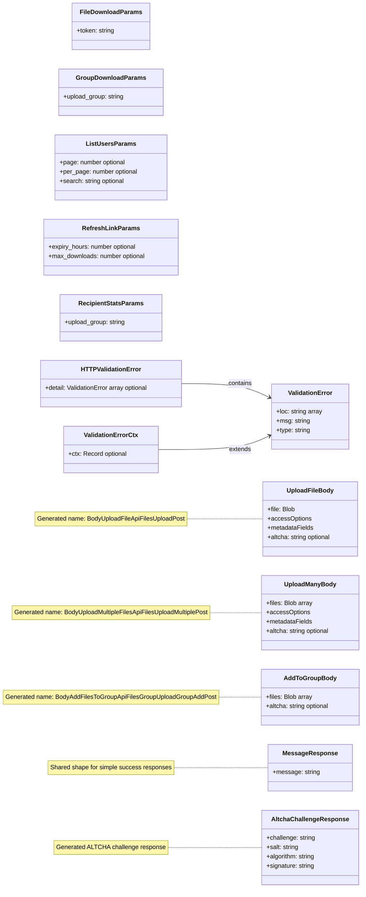

# Reference Schemas & Request Bodies

Generated request-body and parameter names are abbreviated in the diagram. Notes keep the API operation mapping without forcing Mermaid to render very long class names.

---

Reference request bodies, query/path parameter shapes, validation errors, and simple generated response types.