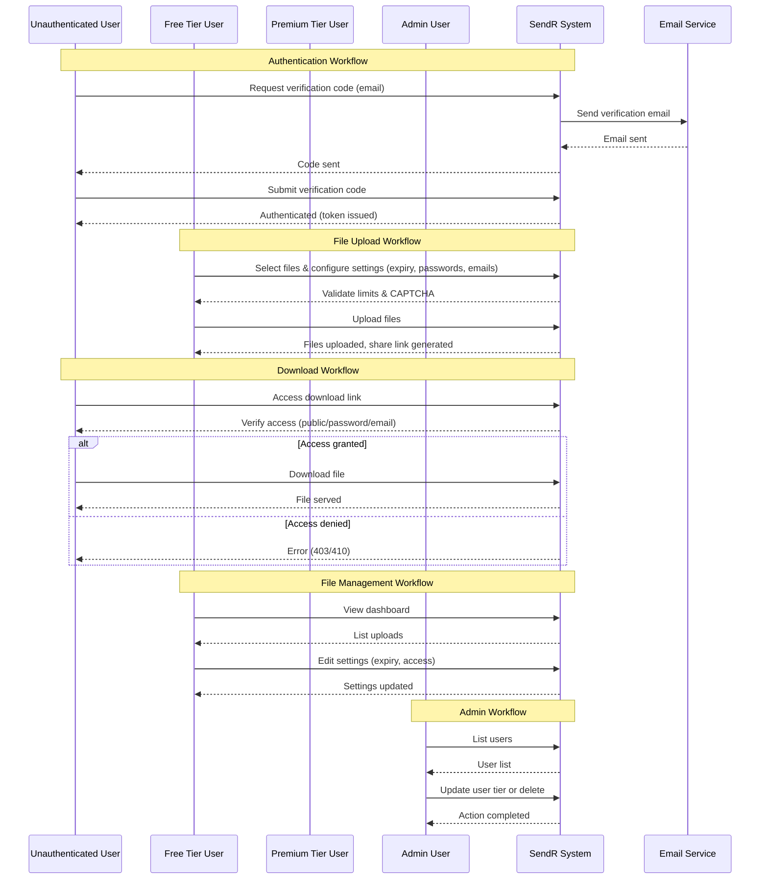

```mermaid
sequenceDiagram
    participant U as Unauthenticated User
    participant F as Free Tier User
    participant P as Premium Tier User
    participant A as Admin User
    participant S as SendR System
    participant E as Email Service

    Note over U,S: Authentication Workflow
    U->>S: Request verification code (email)
    S->>E: Send verification email
    E-->>S: Email sent
    S-->>U: Code sent
    U->>S: Submit verification code
    S-->>U: Authenticated (token issued)

    Note over F,S: File Upload Workflow
    F->>S: Select files & configure settings (expiry, passwords, emails)
    S-->>F: Validate limits & CAPTCHA
    F->>S: Upload files
    S-->>F: Files uploaded, share link generated

    Note over U,S: Download Workflow
    U->>S: Access download link
    S-->>U: Verify access (public/password/email)
    alt Access granted
        U->>S: Download file
        S-->>U: File served
    else Access denied
        S-->>U: Error (403/410)
    end

    Note over F,S: File Management Workflow
    F->>S: View dashboard
    S-->>F: List uploads
    F->>S: Edit settings (expiry, access)
    S-->>F: Settings updated

    Note over A,S: Admin Workflow
    A->>S: List users
    S-->>A: User list
    A->>S: Update user tier or delete
    S-->>A: Action completed
```
