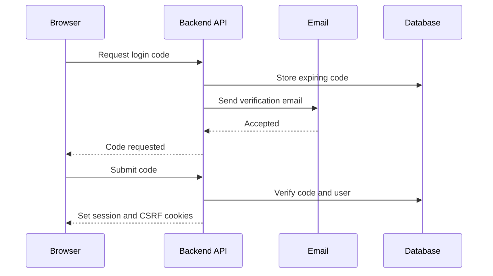
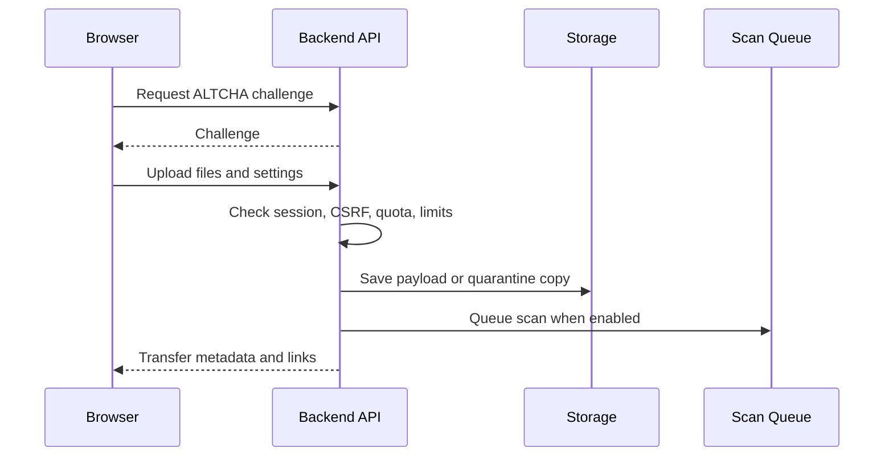
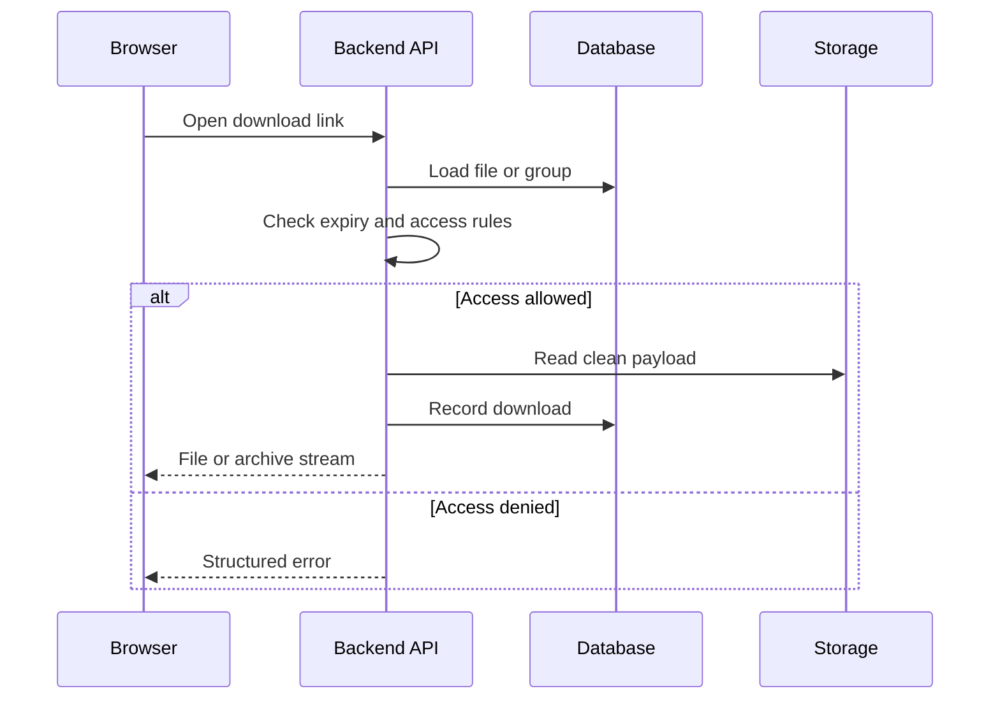
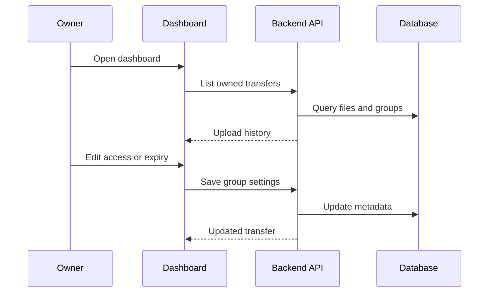
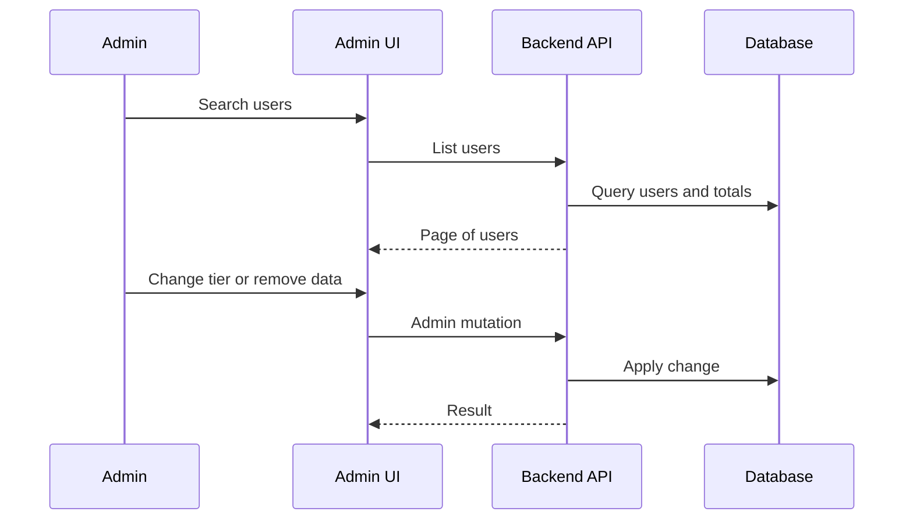

# SendR Workflow Diagrams

The workflows are split into focused diagrams so each one stays readable in a normal documentation viewport.

## Authentication

## Upload

## Download

## Owner Management

## Admin

